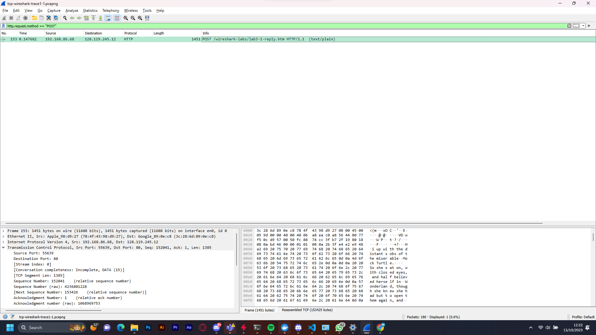
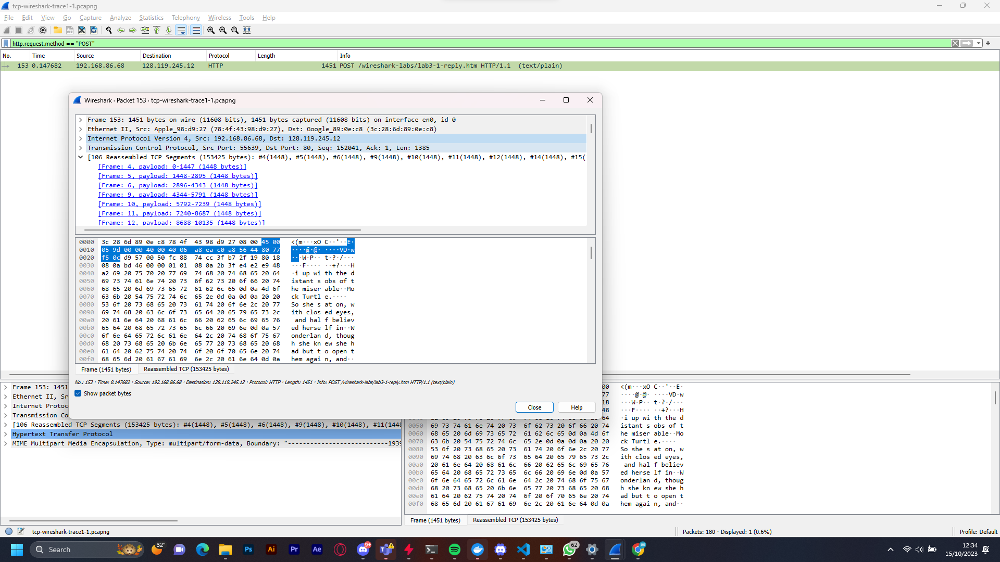
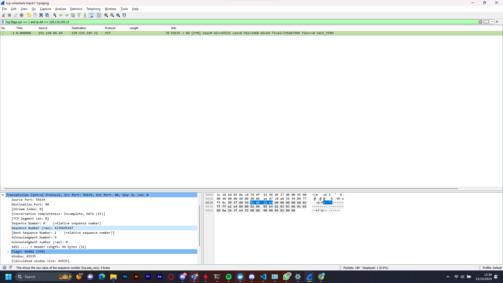
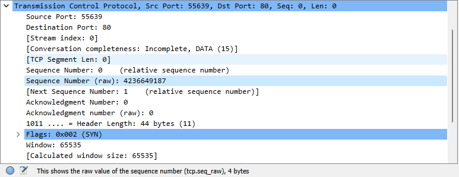
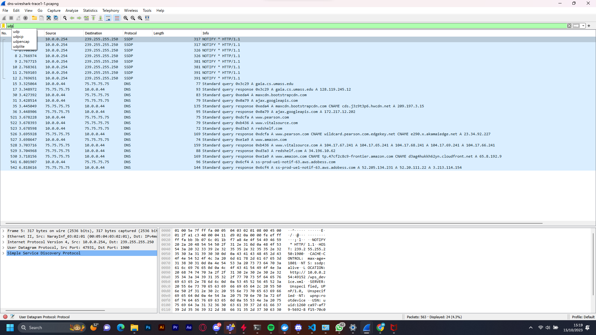
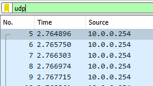
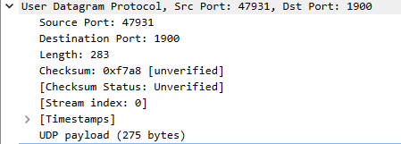
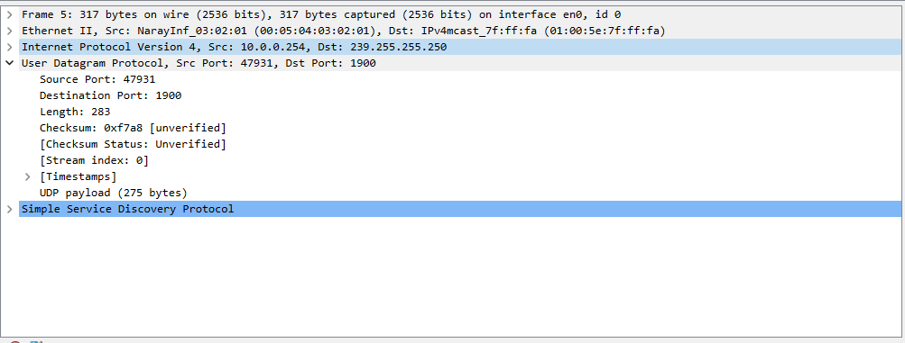

# Handson-Jarkom TCP & UDP

Perkenalkan saya dari kelas `Jaringan Komputer D`, dengan anggota sebagai berikut:

| Nama                   | NRP        |
| ---------------------- | ---------- |
| Dimas Prihady Setyawan | 5025211184 |

### Informasi

Karena kendala Wireshark pada laptop pribadi, saya menggunakan file unduhan dari website gaia.css.umass.edu untuk mengerjakan handson.

### Sesi Soal TCP

### Soal 1

> What is the IP address and TCP port number used by the client computer (source) that is transferring the alice.txt file to gaia.cs.umass.edu?

#### Penjelasan

Anda ingin mengatur ulang perintah Wireshark untuk memfilter paket dengan metode POST pada protokol HTTP. Berikut perintahnya:

1. Buka Wireshark.
2. Di bagian atas jendela Wireshark, Anda akan melihat kotak teks dengan tulisan "Display Filter". Klik di dalam kotak tersebut.
3. Ketik filter berikut: http.request.method == "POST"
4. Tekan Enter atau klik tombol "Apply" untuk menerapkan filter tersebut.

Filter ini akan menampilkan hanya paket yang menggunakan metode POST pada protokol HTTP

#### Jawaban:

Client IP Address: 192.168.86.68

TCP Source Port: 55639

### Soal 2

> What is the IP address of gaia.cs.umass.edu? On what port number is it sending and receiving TCP segments for this connection?

#### Penjelasan

Sama seperti nomor 1, kita hanya perlu melihat dst IP dan dst port dari paket yang ditampilkan.

#### Jawaban:

gaia.cs.umass.edu IP Address: 128.119.245.12

Destination Port: 80

### Soal 3

> What is the sequence number of the TCP SYN segment that is used to initiate the TCP connection between the client computer and gaia.cs.umass.edu?

#### Penjelasan

Masukkan filter `tcp.flags.syn == 1 and ip.dst == 128.119.245.12` pada display filter. Filter ini akan hanya menampilkan paket yang memiliki flag TCP SYN dan ditujukan ke gaia.cs.umass.edu.

Lalu lihat detail dari Transmission Control Protocol, lihat Sequence Number-nya.

#### Jawaban:

Sequence Number: 0

Sequence Number (raw): 4236649187

### Soal 4

> What is the sequence number of the SYNACK segment sent by gaia.cs.umass.edu to the client computer in reply to the SYN? What is it in the segment that identifies the segment as a SYNACK segment? What is the value of the Acknowledgement field in the SYNACK segment? How did gaia.cs.umass.edu determine that value?

#### Penjelasan

Masukkan filter `tcp.flags.syn == 1 and tcp.flags.ack == 1 and ip.src == 128.119.245.12`` pada display filter. Filter ini akan hanya menampilkan paket yang merupakan respon SYN/ACK dari gaia.cs.umass.edu ke klien.

**Raw Sequence Number**

Nilai dari Sequence Number adalah 1068969752

**SYN/ACK Segment**

Dari detail paket di atas, setelah menerapkan filtering yang sama, kita dapat menyimpulkan bahwa segmen tersebut adalah segmen SYN/ACK yang digunakan dalam proses inisiasi koneksi TCP. Hal ini dapat dilihat dari pengaturan kedua flag tersebut yang bernilai 1.

**Acknowledgement Field**

Dari kedua foto di atas, kita dapat menemukan bahwa nilai Acknowledge Field pada paket tersebut adalah 1.

#### Jawaban:

### Soal 5

> What is the sequence number of the TCP segment containing the header of the HTTP POST command?

#### Penjelasan

Masukkan filter yang sama dengan nomor 1, yaitu http.request.method == "POST", pada display filter. Filter ini akan hanya menampilkan paket dengan protokol HTTP yang memiliki metode POST.

Nilai dari Sequence Number dan RAW Sequence Number dapat dilihat pada gambar.

#### Jawaban:

Sequence Number: 152041

RAW Sequence Number: 4236801228

### Soal 6

> Consider the TCP segment containing the HTTP “POST” as the first segment in the data transfer part of the TCP connection:
>
> - At what time was the first segment (the one containing the HTTP POST) in the data-transfer part of the TCP connection sent?
> - At what time was the ACK for this first data-containing segment received?
> - What is the RTT for this first data-containing segment?

#### Penjelasan

Masukkan filter yang sama dengan nomor 1, yaitu `http.request.method == "POST"`, pada display filter. Filter ini akan hanya menampilkan paket dengan protokol HTTP yang memiliki metode POST.

#### Jawaban:

**Arrival Time**

Feb 3, 2021 09:43:26.840557000 SE Asia Standard Time

**Received Time**

Feb 3, 2021 09:43:26.885500000 SE Asia Standard Time

**RTT First Segment**

Dengan mengurangkan waktu kedua paket, kita dapat menemukan nilai RTT dari paket pertama yaitu 0.044943000

### Soal 7

> What is the length (header plus payload) of each of the first four data-carrying TCP segments?

#### Penjelasan

Masukkan filter yang sama dengan nomor 1, yaitu `http.request.method == "POST"`, pada display filter. Filter ini akan hanya menampilkan paket dengan protokol HTTP yang memiliki metode POST.

#### Jawaban:

**First Frame Length**

Pilih HTTP dan cek panjang framenya

Didapatkan bahwa first frame length dari packet adalah **843 bytes (6744 bits)**

**Second Frame Length**

Pilih packet response POST dan cek panjang framenya

Didapatkan bahwa second frame length dari packet adalah **1451 bytes (11608 bits)**

### Sesi Soal UDP

### Soal 1
>Select the first UDP segment in your trace. What is the packet number4 of this segment in the trace file?  What type of application-layer payload or protocol message is being carried in this UDP segment?  Look at the details of this packet in Wireshark.  How many fields there are in the UDP header?

#### Penjelasan

Gunakan filter `UDP` pada display filter. Filter ini akan hanya menampilkan paket dengan protokol UDP. Pilih paket pertama yang muncul.

#### Jawaban:

**The First Packet Number**

Packet Number pertama adalah 5

**Application Layer Payload**

Dari filter di atas, kita dapat menentukan bahwa informasi bahwa paket UDP pertama memiliki port sumber 47931, port tujuan 1900, dan panjang paket sebesar 283. 

**UDP Header Fields**

Dari filter di atas, kita juga dapat menemukan bahwa UDP Header pada packet tersebut terdiri dari 4 komponen, yaitu Source Port, Destination Port, Length, dan Checksum.

### Soal 2
>By consulting the displayed information in Wireshark’s packet content field for this packet (or by consulting the textbook), what is the length (in bytes) of each of the UDP header fields?

#### Penjelasan

Dari filter di atas, kita juga dapat menemukan bahwa UDP Header pada paket tersebut terdiri dari 4 komponen yang masing-masing memiliki panjang 2 bytes. Dengan demikian, total panjang UDP Header adalah 8 bytes. Ini menunjukkan bahwa UDP Header pada paket tersebut mengandung informasi penting seperti Source Port, Destination Port, Length, dan Checksum, dengan setiap bagian ditempatkan dalam dua byte yang membentuk header yang bersifat ringkas namun esensial untuk pengiriman data yang 
efisien melalui protokol UDP.

#### Jawaban:

Total panjang UDP Header adalah 8 bytes.

### Soal 3
>The value in the Length field is the length of what? (You can consult the text for this answer). Verify your claim with your captured UDP packet

#### Penjelasan

Nilai pada field "Length" dalam header UDP menggambarkan panjang total dari segmen UDP, mencakup panjang dari header UDP itu sendiri dan panjang dari data payload. Dalam konteks protokol UDP, "Length" merujuk pada ukuran total segmen UDP dalam byte, termasuk panjang header UDP dan data payload yang diikutsertakan.

Dalam detail paket tersebut, panjang (length) adalah 283. Sesuai dengan penjelasan sebelumnya, angka ini diperoleh dengan menggabungkan total panjang UDP Header (8 bytes) dan panjang payload data UDP (275 bytes), yaitu 8 + 275 = 283.

#### Jawaban:

Total panjangnya adalah 283 bytes dengan cara menghitung panjang UDP Header (8 bytes) dan panjang payload data UDP (275 bytes), yaitu 8 + 275 = 283.

### Soal 4
>What is the maximum number of bytes that can be included in a UDP payload?

#### Jawaban:

Jumlah maksimum byte yang dapat disertakan dalam sebuah payload UDP adalah 65.527 byte. UDP menggunakan sebuah field 16-bit untuk mengindikasikan panjang payload, yang berarti dapat merepresentasikan nilai dari 0 hingga 65.535 (2^16 - 1). Namun, header UDP itu sendiri memiliki panjang sebesar 8 byte. Oleh karena itu, ukuran payload maksimum yang dapat diakomodasi adalah 65.535 - 8 = 65.527 byte. Ini adalah batasan maksimum untuk data yang dapat dibawa dalam payload sebuah paket UDP tunggal.

### Soal 5
>What is the largest possible source port number?

#### Jawaban:

Nomor port sumber terbesar yang dapat digunakan dalam konteks protokol lapisan transportasi UDP atau TCP adalah 65.535. Hal ini disebabkan oleh representasi nomor port dengan menggunakan 16-bit, yang memungkinkan nilai dalam rentang 0 hingga 65.535 (2^16 - 1). Nomor port merupakan elemen penting yang digunakan untuk mengidentifikasi endpoint komunikasi yang berbeda pada sebuah host, dan mereka memainkan peran integral dalam proses addressing dalam komunikasi jaringan

### Soal 6
>What is the protocol number for UDP? Give your answer in decimal notation.

#### Jawaban:

Nomor protokol yang terkait dengan UDP adalah 17 dalam bentuk notasi desimal. Anda dapat menemukan nomor protokol ini dalam field "Protocol" (Protokol) yang ada dalam datagram IP yang mengandung segmen UDP yang Anda ingin analisis. Field "Protocol" ini bertujuan untuk mengidentifikasi protokol transportasi yang digunakan dalam datagram IP tersebut. Dalam konteks UDP, nilai yang diwakili adalah 17 dalam notasi desimal.

### Soal 7
>Examine the pair of UDP packets in which your host sends the first UDP packet and the second UDP packet is a reply to this first UDP packet. (Hint: for a second packet to be sent in response to a first packet, the sender of the first packet should be the destination of the second packet).  What is the packet number5 of the first of these two UDP segments in the trace file?  What is the packet number6 of the second of these two UDP segments in the trace file? Describe the relationship between the port numbers in the two packets

#### Jawaban:

**First Packet Number**

Seperti filter pada nomor 1 UDP, nomor packet pertama adalah 5

**Second Packet Number**

Masih menggunakan filter yang sama, nomor packet kedua adalah 6

**Port Number Relationship**

Source port pada segmen pertama adalah 10.0.0.44, sedangkan destination port pada segmen pertama adalah 75.75.75.75. Sementara itu, source port pada segmen kedua adalah 75.75.75.75, dan destination port pada segmen kedua adalah 10.0.0.44. Hal ini mengindikasikan bahwa segmen kedua adalah respons terhadap permintaan yang diajukan pada segmen pertama dalam konteks protokol UDP